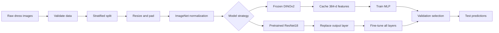

<div align="center">

# Dress Classification with DINOv2 & ResNet18

### Transfer learning for fine-grained fashion-image recognition

[](https://www.python.org/)
[](https://pytorch.org/)
[](https://github.com/facebookresearch/dinov2)
[](https://pytorch.org/vision/stable/models/generated/torchvision.models.resnet18.html)
[](https://slurm.schedmd.com/)

**13,527 labeled images · 10 categories · two transfer-learning strategies · reproducible cluster workflow**

</div>

---

## Overview

This end-to-end deep-learning project studies how pretrained visual representations can classify fashion images into 10 visually similar dress categories. I built and compared two transfer-learning strategies in PyTorch:

1. **Frozen DINOv2 features + a trainable MLP** — efficient experimentation on reusable 384-dimensional image embeddings.
2. **Full ResNet18 fine-tuning** — end-to-end adaptation of every ImageNet-pretrained layer on a GPU cluster.

The work covers data validation, stratified splitting, image preprocessing, feature extraction, hyperparameter search, early stopping, learning-rate scheduling, checkpointing, cluster execution, and generation of test predictions. These are two genuinely different experiments: the DINOv2 encoder is frozen, while ResNet18 is fine-tuned end to end.

## Why this problem is interesting

Fine-grained garment recognition is harder than broad object classification: several classes share similar silhouettes, fabrics, and styling, while the dataset is also strongly imbalanced. This project therefore explores the trade-off between a strong general-purpose representation that is cheap to reuse and a smaller convolutional network that can adapt every feature to the target dataset.

## End-to-end workflow




## Project highlights

- Prepared **13,527 labeled images** and preserved class proportions with a seeded 80/20 train-validation split (**10,821 / 2,706**).
- Classified **10 garment categories**: casual, knitted, evening, jersey, maxi, occasion, shift, denim, shirt, and work dresses.
- Preserved garment geometry by resizing the longest image side and symmetrically padding to `224 × 224`, instead of stretching images.
- Used the pretrained `dinov2_vits14` encoder as a frozen feature extractor and cached the resulting embeddings for faster MLP experiments.
- Compared five learning rates, four MLP architectures, two batch sizes, and constant learning rate versus `ReduceLROnPlateau`.
- Implemented full ResNet18 fine-tuning with a replaced 10-class output layer, validation-based checkpointing, and early stopping.
- Designed the experiments for non-interactive execution on a Slurm-managed GPU cluster.

## Two approaches at a glance

| Approach | Pretrained backbone | What is updated? | Purpose |
|---|---|---|---|
| DINOv2 + MLP | `dinov2_vits14` | MLP only; DINOv2 stays frozen | Fast, compute-efficient baseline |
| ResNet18 | ImageNet ResNet18 | Every layer plus the new classifier | Task-specific, end-to-end fine-tuning |

Freezing DINOv2 makes the first approach efficient, but it also limits adaptation to the specific visual differences between dress categories. The ResNet18 experiment addresses that limitation by updating the convolutional representation itself.

## Best fully recorded result

The best fully recorded DINOv2 + MLP configuration achieved:

| Setting | Selected value |
|---|---:|
| Encoder | DINOv2 ViT-S/14, frozen |
| Feature dimension | 384 |
| MLP hidden layer | 256 units |
| Activation / dropout | ReLU / 0.2 |
| Optimizer | Adam |
| Learning rate | 0.0001 |
| Batch size | 64 |
| Scheduler | ReduceLROnPlateau |
| Best validation loss | **0.9852** |
| Best validation accuracy | **64.41%** |


The lower learning rate converged more slowly but produced the strongest validation result. Larger learning rates improved rapidly at first, then stopped earlier with weaker validation loss. The **64.41% figure is the frozen-DINOv2 baseline**, not the result of end-to-end fine-tuning.

## Method

### 1. Data preparation

The training CSV maps each `article_id` to a `garment_types` target. Labels are converted to a consistent integer mapping, then split with `random_state=42` and stratification. The test data stays outside model selection.

Each image passes through the same deterministic pipeline:

```text
RGB image
  → resize longest side to 224 px (preserve aspect ratio)
  → symmetric zero-padding to 224 × 224
  → tensor conversion
  → ImageNet normalization
```

### 2. DINOv2 feature pipeline

`dinov2_vits14` is loaded through PyTorch Hub and kept in evaluation mode with gradients disabled. It converts each image into a 384-dimensional embedding. Training, validation, and test embeddings are saved once, so the downstream MLP search does not repeatedly run the vision transformer.

The search is deliberately sequential to control compute:

1. Select a learning rate with architecture `[256]` and batch size 64.
2. Compare hidden-layer layouts using the selected learning rate.
3. Compare batch sizes using the selected architecture.
4. Compare a constant learning rate with `ReduceLROnPlateau`.
5. Restore the checkpoint with the lowest validation loss and generate test predictions.

Full experiment tables are stored in [`results/`](results/).

### 3. Full ResNet18 fine-tuning

The ImageNet-pretrained ResNet18 classifier is changed from 1,000 outputs to 10. All parameters—not only the new classification head—are passed to Adam, making this full fine-tuning. This approach was expected to adapt more directly to the dataset than the frozen encoder, at the cost of substantially more GPU time.

Four small learning rates are scanned in controlled short trials. The best candidate is then used for longer constant-LR and scheduler runs with early stopping. The first cluster run reached its 30-minute Slurm limit before the complete ResNet18 report was written, so the continuation notebook resumes from saved artifacts without repeating the learning-rate scan. The surviving checkpoint records an early `5e-4` trial at 54.80% validation accuracy (epoch 2), but this is not a completed model comparison. A final ResNet18 metric is intentionally not claimed because a complete exported result table is not present.

The next improvement would be to rerun the continuation job with a longer wall-time allocation, then compare the final ResNet18 checkpoint against the frozen-DINOv2 baseline on the same untouched test set. Class-weighted loss or balanced sampling would also be worth evaluating because the training distribution is strongly imbalanced.

## Repository structure

```text
.
├── notebooks/
│   ├── 01_dinov2_mlp_cluster.ipynb
│   ├── 02_resnet18_finetuning_cluster.ipynb
│   └── 03_resnet18_continuation.ipynb
├── results/
│   ├── *.csv                 # hyperparameter summaries
│   └── *.png                 # experiment visualizations
├── cluster/
│   └── run_notebook.slurm    # reusable cluster job template
├── requirements.txt
└── README.md
```

The raw image dataset, CSV splits, cached feature tensors, and model checkpoints are deliberately excluded. They are large, environment-specific, and may be subject to the original dataset's distribution terms.

## Reproducing the work

### Local setup

```bash
python -m venv .venv
source .venv/bin/activate          # Windows: .venv\Scripts\activate
pip install -r requirements.txt
```

Place the data in the repository root using this layout:

```text
raw/<article_id>.jpg
train_2025.csv
test_2025.csv
```

The training CSV must contain `article_id` and `garment_types`; the test CSV must contain `article_id`. Launch Jupyter from the repository root so `Path.cwd()` resolves the data and output directories correctly.

```bash
jupyter lab
```

### Cluster execution

Update the environment and resource placeholders in [`cluster/run_notebook.slurm`](cluster/run_notebook.slurm), then submit one notebook at a time:

```bash
sbatch cluster/run_notebook.slurm notebooks/01_dinov2_mlp_cluster.ipynb
sbatch cluster/run_notebook.slurm notebooks/02_resnet18_finetuning_cluster.ipynb
```

The job executes notebooks non-interactively with `nbconvert`, retains cell outputs in a new `*_executed.ipynb`, and writes experiment artifacts to `results/`, `features/`, and `checkpoints/`.

## What I learned

- Caching foundation-model embeddings turns repeated classifier experiments into a much cheaper workflow.
- Validation loss is a more reliable checkpoint criterion than training accuracy when tuning on an imbalanced dataset.
- Small learning rates are important when updating a pretrained CNN end to end.
- Cluster jobs need resumable checkpoints and output files because wall-time limits can stop a notebook before its reporting cells finish.
- Keeping the test set out of hyperparameter decisions is essential for an honest final comparison.

## Notes

This repository is an educational portfolio version of the project. It contains the implementation and recorded experiment summaries, but not the source dataset or trained binary weights.
